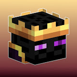

## [PlanetMaple Network](https://planetpaple.org)

A Christian Run Minecraft Server with not Just Minigames but also open-world Factions,  Voice Chat, Discord SVC, Party Games, AmongUs, and full Cross Platform Compatibility!

**Why was PlanetMaple Created?** - A53o

PlanetMaple has been a dream of mine for a while. It started out as a kind of trash SMP with my friends and failed on day one. At the time I didn't have experience hosting a server. After it failed, I didn't touch it for a while, but then I got the idea to create a minigame network. It was under a different name, but the idea was there. I worked on that server for a long time, mostly battling hardware issues, and after a while I pretty much gave up. It was only after months that I decided to start from scratch.

That brings us to where the server is now. PlanetMaple is a server I will continue develop to reach people with the gospel. I love the Lord because He has changed my life, and I want to help others serve Him. If you have never properly heard the gospel before, read 1 Peter 2:22–24 (NIV). The Lord is the reason this server is in the works today.

###### This Readme will be completed after the release of closed beta.
